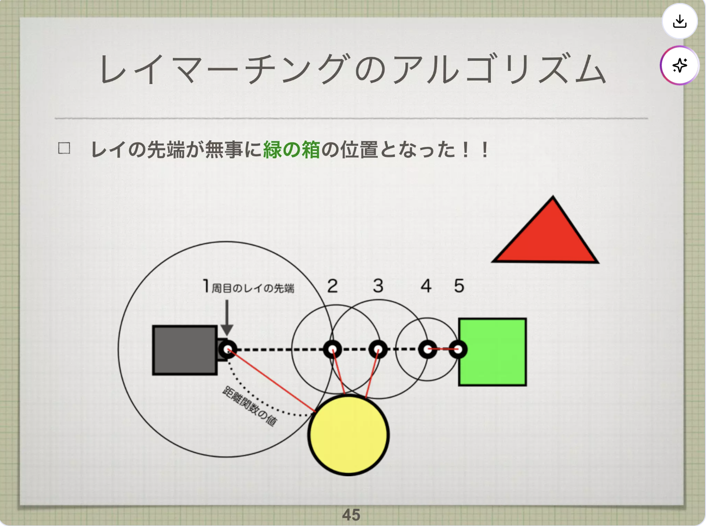
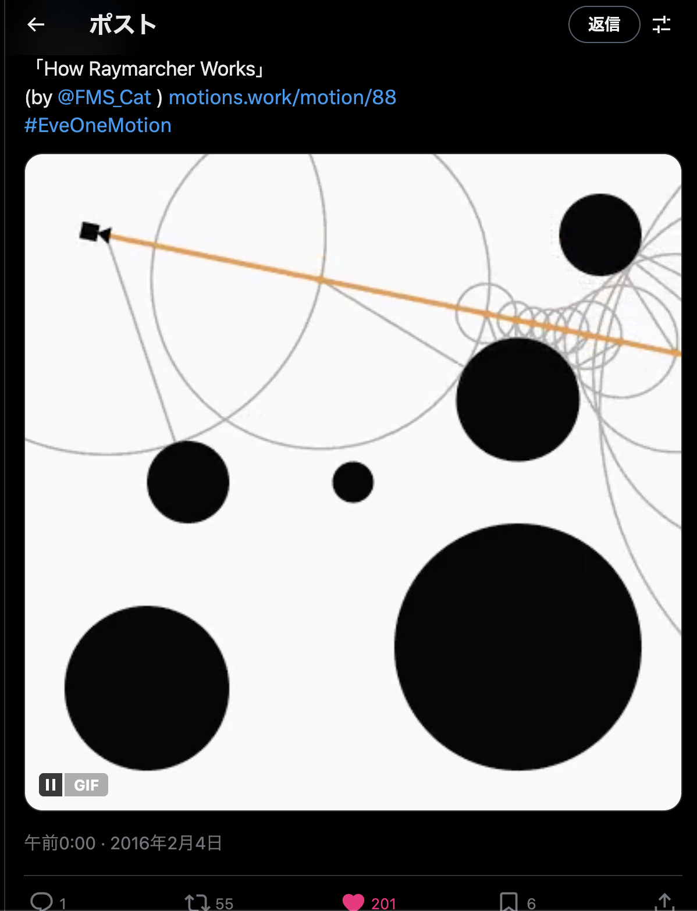

# レイマーチング

参考:

- https://www.slideshare.net/slideshow/threejs-58238484/58238484
- https://youtu.be/gtSgPV10jDk?si=HVXV3xx17ruphUJc
- https://x.com/motions_work/status/694898149622550528?s=20

---

## レイマーチングとは

**`距離関数(*1)`によって定義された`シーン(*2)`に対して、`レイを進めながら衝突判定(*3)`を行い、描画を行う手法。**

### 3D 描画方法は主に２つある

1. ラスタライズ法
2. レイトレーシング法

#### ラスタライズ法

- 三角形を１つとして、その組み合わせで表現
- 3D の頂点を 2D として映す表現
- 処理が軽い

#### レイトレーシング法

- カメラに届く光線（レイ）を全ピクセルでシミュレーション
- ピクセル一つずつ処理をするので処理は重い
- 滑らかで物理現象の再現が可能
- 下記リンク先のイメージです
  - [シミュレーション](https://qiita-user-contents.imgix.net/https%3A%2F%2Fqiita-image-store.s3.ap-northeast-1.amazonaws.com%2F0%2F136662%2Fe0c46ce8-11d7-94f9-017f-acbbcc8a0a25.gif?ixlib=rb-4.0.0&auto=format&gif-q=60&q=75&s=5aad14b6a76a94f1e0051f9138183ac3)
  - 参考：[https://qiita.com/kaneta1992/items/21149c78159bd27e0860]

---

## 1. 距離関数とは

距離関数とは、

> **空間上の点 P を入力として、その点からシーン内の物体までの最短距離を返す関数**

である。

- **入力**：3 次元座標 P（vec3）
- **出力**：点 P から最も近い物体までの距離（float）

距離の符号には次の意味がある。

| 値  | 意味       |
| --- | ---------- |
| 正  | 物体の外側 |
| 0   | 物体の表面 |
| 負  | 物体の内側 |

物体の形によって距離の求め方は変わる。

たとえば、円の場合

原点 P から中心 C、半径 r の円の最短距離を求める場合は次のように書ける。

```text
距離 = |P - C| - r
距離 = 原点からの距離 - 半径r
```

点 P から中心までの距離から半径を引くことで、「円の表面までの距離」になる。

その他の形の距離関数はこちらを参考に
https://iquilezles.org/articles/distfunctions/

---

## 2.シーンとは

**距離関数によって定義された、すべての物体の集合**を指す。

複数の物体がある場合は、それぞれの距離関数を評価し、その最小値を取ることでシーン全体の距離関数を構成する。

---

## 3.「レイを少しずつ進めながら衝突判定」とは

レイマーチングでは、固定距離でレイを進めるのではなく、

> **「現在位置から最も近い物体までの距離」だけ安全にジャンプする**

という操作を繰り返す。

具体的な手順のイメージはこちらです

https://www.slideshare.net/slideshow/threejs-58238484/58238484#45

詳細は下記スライドリンク#36~#45 をご覧ください。
https://www.slideshare.net/slideshow/threejs-58238484/58238484#36

レイマーチングでは、レイを一定量ずつ進めるのではなく、
常に「今いる位置から最も近い物体までの距離」を使って進む。

そのため、次のような性質を持つ。

- 衝突するまで繰り返す
- 最短距離だけ進めるので、進みすぎて通り過ぎることがない

この「距離を測って進む」という処理をループとして繰り返す部分を、
レイマーチングではマーチングループと呼ぶ。

---

### マーチングループのアルゴリズム（コード）

```c
float dist;
float depth = 0.0;
vec3 p = origin;
vec3 rayDirection = normalize(...);

for ( int i = 0; i < 64; i++ ){
    dist = sceneDist( p );
    depth += dist;
    p = origin + depth * rayDirection;

    if ( abs(dist) < EPS ) break;
}
```

日本語モデルにすると...

```c
最短距離
進んだ距離 = 0.0
レイの現在位置[x, y] = レイの開始位置[x, y]
レイの向き[dx, dy] = 正規化された方向ベクトル

最大 64 回 くり返す:
    最短距離 = 距離関数(レイの現在位置)
    進んだ距離 = 進んだ距離 + 最短距離
    レイの現在位置 = レイの開始位置 + 進んだ距離 × レイの向き

    もし |最短距離| < 0.001 なら 終了
```

イメージシミュレーション<br>

https://x.com/motions_work/status/694898149622550528?s=20
